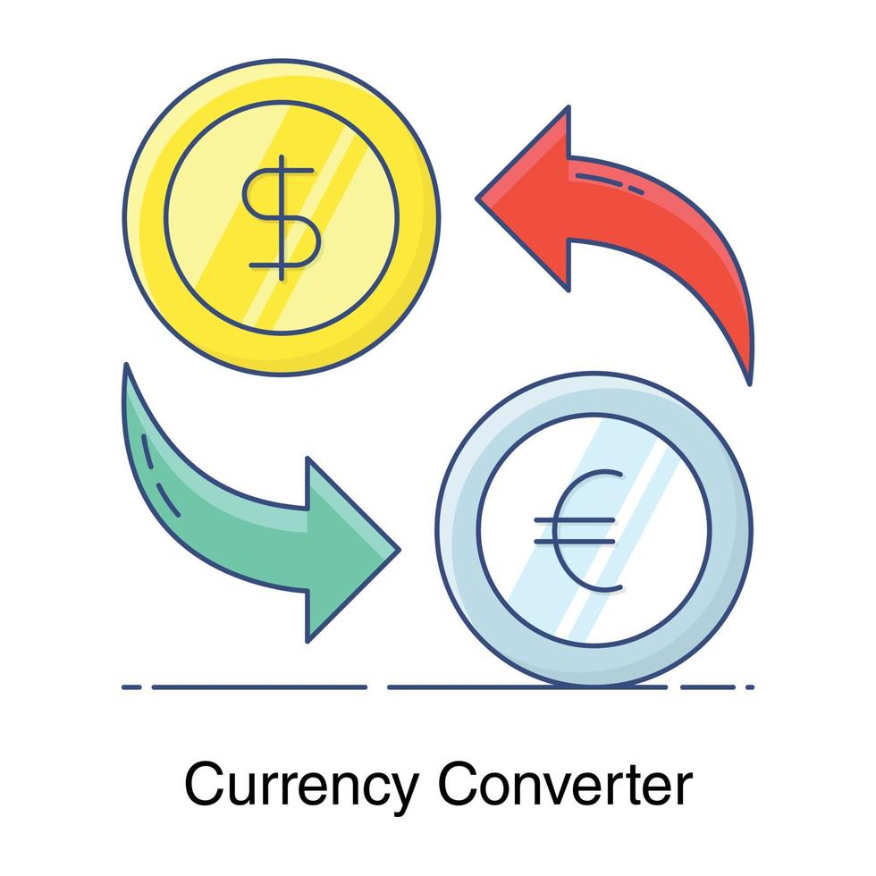

<div align="center">
  <h1 align="center">
    Conversor de Moedas
    <br />
    <br />
    <a href="https://github.com/Rafael-LynX/conversor-moeda#">
      
    </a>
  </h1>
</div>

<p align="center">
  <a href="#license"></a>
</p>

## 📖 About The Project

[![Conversor de Moedas][conversor-moedas]](assets/image.png)

O projeto foi feito devido a um desafio do curso da Alura do programa Oracle-ONE, esse projeto visa trabalhar o uso de API
e json para aprendizado. No meu código acabeu criando 3 classes principais main, moedaAPI e moedas:

* `moedas` faz encapsulamento dos dados da moeda. 
* `moedaAPI` lida com os dados da API.
* `main` possui o menu para uso do usuário, e ele faz todo o processo da API chama ela e a converte para o usuário.

Código foi feito com simplicidade somente para o aprendizado, mas meu foco sempre é aprender Java junto com o curso, 
sempre pensando na segurança dele, ainda está muito longe do ideal. Melhorias que poderia ter acontecido:

* O `HttpClient` poderia ser usado dentro de um método para otimização
* Uma instância poderia ter sido criado para `Gson`
* `MoedaAPI` poderia validar os dados retornados, evitando erros. 

Essas são somente algumas que eu poderiam ter sido implementadas.

### 🔑 Key-Features
- `logger`: Utilizei o logger pela a recomendação do sonarQube ele traz alguns beneficios como segurança, desempenho, manutenção e profissionalismo ao código. 
- `HandlerParaLogger`: É uma classe para melhorar a saída do logger, sem ela ficaria muito poluído a saída.
- `Map<String Double>`: O uso map serve para representar de forma eficiente e organizada a taxa de conversão, string representa a siglas (USD, BRL)
double representa seu valor (0.15, 1.20), o uso dela é mais simples e eficiente.
- `Dotenv`: O dotenv ajuda no gerenciamento da variável de ambiente API_KEY, facilitando sua configuração e melhorando sua segurança.
- `converterTaxaDeCambio`: É onde ocorre a conversão de moedas, utilizando Gson para desserializar o JSON recebido pela API.

## 🚀 Getting Started

Conversor Moedas precisa de algumas configurações específicas para sua utilização
entre elas configurar sua API_KEY, e configurar o sistema de cores caso use IntelliJ IDEA

### 📋 Prerequisites

Essa configuração serve somente para aqueles vão testar no IntelliJ IDEA, essa configuração
vai permitir o uso de cores no terminal dela.

* configs
```sh
File > Settings > Advanced Settings > Run/Debug
```
Quando chegar marque a opção:
```sh
Enable ANSI colors in console output
```

### 🔧 Installation

Para sua instalação precisamos somente clonar o repositorio e criar uma API_KEY. 

1. Crie uma conta e pegue sua API_KEY [ExchangeRate-API](https://app.exchangerate-api.com/)

2. Clone o repositório:
   ```sh
   git clone https://github.com/Rafael-LynX/conversor-moeda.git
   ```
3. Crie o arquivo .env com sua API_KEY:
    ```.env
    API_KEY=
    ```

## 🛠️ Built With

Ele foi construido apenas com Java.

* [](https://www.java.com/pt-BR/)

## 📄 License

Conversor de Moedas é distribúido sob a Licença [MIT licensed](./LICENSE).

## 🏆 Autor

[<br><sub>Rafael Vieira</sub>](https://github.com/Rafael-LynX) 


